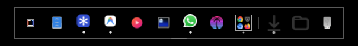
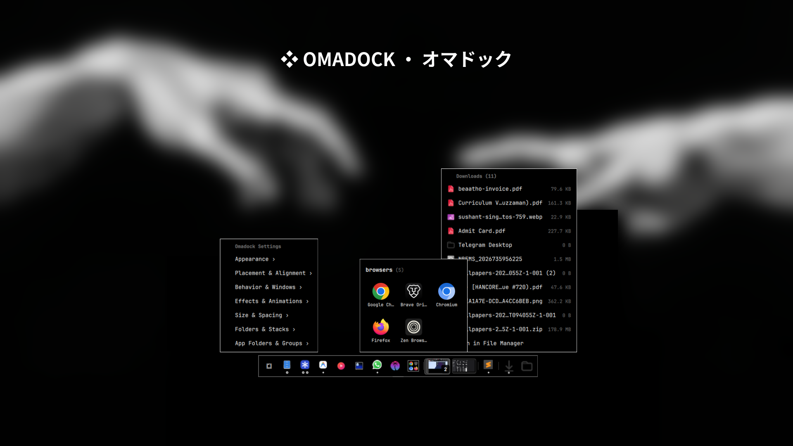

# Omadock (`omadock`)

<p align="center">
  
</p>

<p align="center">
  <b>A modern, high-performance application dock for <a href="https://omarchy.org">Omarchy</a> (Quickshell + Hyprland).</b>
</p>

<p align="center">
  <a href="https://github.com/thepathless/omadock/releases"></a>
  <a href="https://omarchy.org"></a>
  <a href="https://hyprland.org"></a>
  <a href="https://quickshell.org"></a>
  <a href="LICENSE"></a>
</p>

---

## Overview

**Omadock** is a lightweight, zero-CPU application dock crafted natively for Omarchy. It brings smooth autohide behaviors, intelligent window overlap detection, layout-aware window focus, workspace hints, urgent highlights, multi-window cycling via mouse wheel, live drag-and-drop icon reordering, and a deep hierarchical customization suite directly accessible from the dock.

<p align="center">
  
</p>

---

## ⚡ Installation & Management

### Install (Single Command)
Install and enable **Omadock** in Omarchy with a single command:

```bash
omarchy plugin add https://github.com/thepathless/omadock.git --enable --yes
```

### Update
Update to the latest release at any time:

```bash
omarchy plugin update omadock --yes
```

### Removal / Uninstall
To disable and completely remove Omadock from Omarchy:

```bash
omarchy plugin remove omadock --yes
```

---

## ✨ Features

### 🎯 Zero-CPU Reactive Autohide & Tiling Adaptation
- **Scale-Aware Thresholding**: Automatically calculates fractional scaling across HiDPI monitors to detect bottom edge cursor reveal.
- **Intelligent Window Overlap Detection**: Debounced, event-driven Hyprland client inspections with **0% continuous CPU polling**.
- **Tiling Window Adaptation**: When in **Always Show** mode, Omadock sets a Wayland `exclusiveZone`, ensuring tiled Hyprland windows reserve bottom space and never overlap the dock.
- **Click Pass-Through Input Masking**: The trigger reveal zone passes through clicks to underlying desktop applications without swallowing inputs.

### 🎨 Deep Right-Click Customization Suite
Right-click the leftmost Omarchy icon to open the native settings menu:
- **Autohide Modes**:
  - `Always Show` — Stays permanently visible with active window margin reservation.
  - `Intelligent Autohide` — Stays visible on empty workspaces; hides smoothly when windows overlap.
  - `Auto Hide` — Standard edge-reveal dock.
- **Dock Corner Shapes**:
  - `Auto (Theme)` — Dynamically mirrors active Hyprland / Omarchy theme rounding (`decoration:rounding`).
  - `Rounded` — Modern rounded rectangle with proportional scaling.
  - `Round` — Full capsule / pill curvature (`height / 2`).
  - `Square` — Sharp minimalist edges (`0px`).
- **Background Opacity**:
  - `Auto (Theme)` — Automatically matches the active Omarchy theme's bar/panel opacity (`Color.bar.background.a`).
  - `Opaque (100%)`
  - `Glass (80%)`
  - `Frosted Glass (65%)`
  - `Translucent (35%)`
  - `Transparent (0%)` *(retains outer card outline border)*
- **Background Color Picker**:
  - `Theme (Default)` — Automatically tracks active Omarchy desktop theme colors (`Color.bar.background`).
  - `No Color` — Clean transparent base fill.
  - `Preset Palette Swatches` — 10 curated colors (Pure Black, Mocha, Deep Slate, Midnight Blue, Dark Navy, Emerald Forest, Espresso, Velvet Ruby, Midnight Purple, Slate Grey).
  - **Automatic Foreground Contrast**: A custom dock color is measured against the theme's bar foreground, and the launcher glyph, indicators, separator, and card outline flip to the readable side when the two collide — a dark card under a light theme no longer draws dark-on-dark, and the reverse holds too.
- **Icon Sizing & Spacing**:
  - Sizes: `Small (28px)`, `Medium (36px)`, `Large (44px)`, `Extra Large (52px)`.
  - Spacing: `Compact (2px)`, `Normal (4px)`, `Relaxed (8px)`.
- **Toggles**:
  - `Show Tooltips` — Toggle hover name tooltips.
  - `Urgent Highlights` — Toggle the pulsing attention indicator.
  - `Click Active to Minimize` — Toggle minimize-on-click for the focused app.

### 🔘 3-State Window Indicator System & Dynamic Multi-Window Scaling
- **Instant Visual State Recognition**:
  - `[ ▬ ]` **Active Focused Window** — Illuminated theme-accented bar (`12px`).
  - `[ ● ]` **Open Visible Window** — High-contrast solid dot (`5px`).
  - `[ ○ ]` **Minimized / Parked Window** — Instant hollow circle ring with transparent fill (`5px`, `1.5px` border).
- **Adaptive Multi-Window Layout**:
  - **1–4 Windows**: Each window receives its own distinct indicator dot/bar.
  - **5 Windows**: Dynamic micro-dot compression (`4px` dots, `9px` bar) fits 5 instances seamlessly.
  - **6+ Windows**: Renders the first 4 window states + a sleek miniature `+N` count pill (`[ ▬ ] [ ● ] [ ○ ] [ ● ] [ +4 ]`).

### 🔄 Granular Sequential & Group Minimization / Restoration
- **Three Configurable Minimize Modes**:
  - **`Active Window`** *(Sequential)*: Clicking a focused application minimizes only that active window into a hollow ring `○`, seamlessly passing focus to sibling windows. Clicking from a minimized state sequentially restores windows in chronological FIFO order.
  - **`All Windows`** *(Group Hide)*: 1-click batch minimize/restore for the entire application across the workspace.
  - **`Disabled`** *(Classic)*: Clicking an active window cycles focus to the next instance.
- **Hidden Workspace Parking**: Parked windows sit on Hyprland's native `special:minimized` workspace and remember their exact origin workspace.

### 📜 Interactive Multi-Window Tooltips with Scroll Selection
- **Hover Previews**: Tooltips display up to 8 live window titles with workspace hints and `[minimized]` / `[starting…]` badges.
- **Scroll-to-Select**: Scroll your mouse wheel over the dock icon to cycle through open and minimized windows directly in the tooltip (`› Window Title [minimized]`).
- **Click-to-Restore**: Left-clicking while a window is highlighted in the tooltip instantly un-minimizes and focuses that exact window.

### 🪟 Layout-Aware Window Focus & Compositor Dispatching
- **Compositor-Native Focus**: Clicks and wheel cycling go through Hyprland's own focus dispatcher instead of plain Wayland activate requests, so **scrolling layouts scroll the target column into view** rather than leaving the window off-screen. Supports both Lua (Hyprland 0.56+) and legacy dispatchers.
- **Attention & Urgency Alerts**: Desktop notification urgency triggers real-time icon hopping and sound feedback, while active foreground windows automatically suppress distracting alerts.
- **Launch Feedback**: Clicking a cold app pulses its icon until the window shows up, preventing duplicate launch attempts.

### 🔄 Live Drag-and-Drop Reordering
- Click and drag pinned app icons to rearrange them live.
- Real-time insertion indicator lines guide placement.
- Automatically saves new pin order to `~/.config/omarchy/dock.json`.

---

## ⚙️ Configuration Reference

All settings can be toggled interactively via the right-click menu or configured manually in `~/.config/omarchy/omadock.json`:

```json
{
  "autohide": true,
  "intelligentAutohide": true,
  "showAppsButton": true,
  "showTooltips": true,
  "opacity": 1.0,
  "shape": "rounded",
  "bgColor": "theme",
  "itemSpacing": 4,
  "screen": "",
  "iconSize": 36,
  "hoverEffect": "zoom",
  "clickToMinimize": false,
  "showUrgentHint": true,
  "revealDelay": 160,
  "tooltipDelay": 450
}
```

| Property | Type | Default | Description |
| :--- | :--- | :--- | :--- |
| `autohide` | `boolean` | `true` | Enable autohide on hover reveal. Set `false` for always-visible dock. |
| `intelligentAutohide` | `boolean` | `true` | Hide dock only when windows on the current workspace overlap its area. |
| `opacity` | `number \| string` | `1.0` | Background transparency (`"theme"`, `1.0`, `0.80`, `0.65`, `0.35`, `0.0`). |
| `shape` | `string` | `"rounded"` | Corner shape style (`"rounded"`, `"round"`, or `"square"`). |
| `bgColor` | `string` | `"theme"` | Base color (`"theme"`, `"none"`, or custom hex string e.g. `"#1e1e2e"`). A custom hex value also switches dock glyphs and indicators to whichever side reads against it. |
| `itemSpacing` | `number` | `4` | Spacing in pixels between icons (`2`, `4`, `8`). |
| `iconSize` | `number` | `0` | Icon size in pixels (`28`, `36`, `44`, `52` or `0` for auto). |
| `showAppsButton` | `boolean` | `true` | Show or hide the Omarchy apps launcher button on the left edge. |
| `showTooltips` | `boolean` | `true` | Show app name tooltips on mouse hover. |
| `screen` | `string` | `""` | Optional monitor name to pin the dock to (defaults to the first monitor). |
| `hoverEffect` | `string` | `"zoom"` | Hover growth: `"zoom"` grows only the icon under the pointer and leaves the layout still, `"wave"` runs a raised-cosine falloff across neighbours and lets the row carry the extra width, `"off"` disables it. |
| `clickToMinimize` | `boolean` | `false` | Clicking the focused single-window app parks it on a hidden `special:minimized` workspace; clicking again restores it. |
| `showUrgentHint` | `boolean` | `true` | Pulse the indicator and icon ring when a window demands attention. |
| `revealDelay` | `number` | `160` | Milliseconds the pointer must dwell on the screen edge before an autohidden dock reveals. `0` reveals immediately. |
| `tooltipDelay` | `number` | `450` | Milliseconds of hover before a tooltip appears. `0` shows it immediately. |

### Pinned Applications (`~/.config/omarchy/dock.json`)

```json
{
  "pinned": [
    "foot",
    "org.gnome.Nautilus",
    "google-chrome",
    "code"
  ]
}
```

---

## ⌨️ Controls & Interactions

| Action | Target | Description |
| :--- | :--- | :--- |
| **Left Click** | Omarchy Icon | Opens Omarchy Application Search Menu |
| **Right Click** | Omarchy Icon | Opens **Omadock Settings** menu |
| **Left Click** | App Icon | Launches app, or focuses / cycles / minimizes its windows |
| **Middle Click** | App Icon | Opens a new window of the app |
| **Mouse Wheel** | App Icon | Cycles forward/backward between open windows |
| **Right Click** | App Icon | Shows open window list, Pin/Unpin, and Close actions |
| **Drag & Drop** | App Icon | Reorders pinned application icons |
| **Bottom Edge Hover** | Screen Bottom | Reveals autohidden dock after `revealDelay` |

---

## 🛠️ Diagnostics & Validation

To test and hot-reload changes:

```bash
omarchy restart shell
```

Validate plugin manifest schema:

```bash
omarchy plugin validate ~/.config/omarchy/plugins/omadock
```

Inspect live logs:

```bash
journalctl --user -xeu omarchy-shell -n 50
```

---

## 📄 License

Distributed under the [MIT License](LICENSE). Copyright (c) 2026 Suvadeep Mondal.

