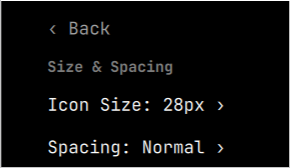
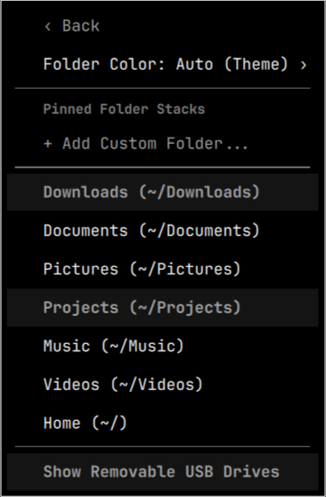
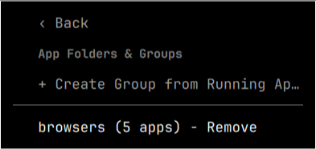

<div align="center">

# ❖ OMADOCK ・ オマドック

### *A modern, fluid, zero-CPU application dock engineered for Omarchy Linux*

[](https://github.com/thepathless/omadock/releases)
[](https://omarchy.org)
[](https://hyprland.org)
[](https://quickshell.org)
[](LICENSE)

<br />

<p align="center">
  
</p>

<p align="center">
  <a href="#-quick-start"><b>Quick Start</b></a> •
  <a href="#-core-features"><b>Features</b></a> •
  <a href="#-minimized-preview-tiles"><b>Preview Tiles</b></a> •
  <a href="#-customization--theming"><b>Theming</b></a> •
  <a href="#%EF%B8%8F-controls-cheat-sheet"><b>Controls</b></a> •
  <a href="#%EF%B8%8F-configuration-reference"><b>Configuration</b></a> •
  <a href="#-keyboard-shortcuts-via-ipc"><b>Keybindings</b></a> •
  <a href="#-faq"><b>FAQ</b></a>
</p>

</div>

---

## ⚡ Overview

**Omadock (オマドック)** is an ultra-fast, lightweight shell overlay plugin built natively for **[Omarchy](https://omarchy.org/)** (Arch Linux + Hyprland + Quickshell).

Crafted in the spirit of **Omakase (おまかせ)** — curated elegance and effortless flow — Omadock bridges the gap between dynamic tiling compositors and tactile desktop ergonomics. It delivers fluid wave magnification, live screencopy preview cards, and multi-instance window management with strictly **0.00% background CPU consumption**.

<p align="center">
  
</p>

### ✨ Key Highlights

- **🔘 3-State Window Dots**: Instant visual indicator dots for active, visible, and minimized windows.
- **🌊 Continuous Wave Physics**: Fluid cosine-falloff cursor wave dynamics alongside classic zoom mode with zero coordinate jumping.
- **🪟 Visual Window Previews**: Minimized windows park directly on the dock as visual thumbnail cards.
- **📁 App Group Folders**: 2x2 live preview grid, popover tray, drag-to-group, in-place title editing, drag-to-pin, and drag-out extraction to ungroup/unpin.
- **💾 Removable Media Auto-Docking**: USB and removable drive detection with mountpoint badges, storage tooltips, and contextual eject/unmount actions.
- **📐 Dock Alignment Options**: Bottom alignment support (`center`, `left`, `right`) with dynamic coordinate compensation and Hyprland workspace integration.
- **⚡ FreeDesktop Jump Lists**: Contextual quick actions for supported desktop applications.
- **📂 Folder Stacks & Popovers**: 1-click popovers for recent files with automatic theme sync and color presets.
- **🔔 Attention Glow & Canberra Chimes**: Bouncing alerts and audio chimes for background notifications.
- **🎯 Intelligent Zero-CPU Autohide**: Event-driven 2D Axis-Aligned Bounding Box (AABB) window overlap detection aware of all tiled and floating windows.
- **🔄 Fluid Drag-and-Drop**: Drag pinned items to reorder with live real-time insertion markers.
- **⌨️ Desktop Keybindings**: Automated `bind-keys.sh` integration with `~/.config/hypr/bindings.lua` (`SUPER + D`, `SUPER + M`, `SUPER + SHIFT + M`).

---

## 🚀 Quick Start

### Install

```bash
omarchy plugin add https://github.com/thepathless/omadock.git --enable --yes
```

### Update

```bash
omarchy plugin update omadock --yes
```

### Removal / Uninstall

```bash
omarchy plugin remove omadock --yes
```

---

## 🌟 Core Features

### 🔘 1. 3-State Window Indicators

Every running application icon features micro-indicators communicating the exact state of all open instances:

```
  ┌─────────────────────────────────────────────────────────────┐
  │  INDICATOR LEGEND:                                          │
  │   [ ▬ ] Active / Focused Window   (Illuminated Theme Bar)   │
  │   [ ● ] Open / Visible Window     (Solid High-Contrast Dot) │
  │   [ ○ ] Minimized / Parked Window (Hollow Circle Ring)      │
  └─────────────────────────────────────────────────────────────┘
```

| Window Count | Indicator Visual | Behavior |
| :--- | :--- | :--- |
| **1–4 windows** | `[ ▬ ] [ ● ] [ ○ ] [ ● ]` | Dedicated indicator dot/bar for every individual window. |
| **5 windows** | `[ ▬ ] [ ● ] [ ● ] [ ● ] [ ● ]` | Micro-dot scaling ($4\text{px}$) fits up to 5 instances cleanly. |
| **6+ windows** | `[ ▬ ] [ ● ] [ ● ] [ ● ] [ +N ]` | First 4 instance dots plus a compact `+N` count badge. |

---

### 🪟 2. Minimized Preview Tiles

When a window is parked on `special:minimized`, Omadock generates a live visual preview tile between your pinned and running applications:

<div align="center">
  
</div>

- **📸 Visual Window Previews**: Displays a clean, static thumbnail of the window upon minimization.
- **🎯 1-Click Restore**: Left-clicking any preview tile restores the window directly onto your **currently active workspace**.
- **📍 Origin Restoration**: Right-click any tile to choose between **Restore Here**, **Restore to Original Workspace**, or **Close**.
- **📦 Stacked Group Cards**: In `"all"` mode, multiple windows from the same application bundle into a stacked visual card with count badge.
- **🧩 Space-Saving Icon Collapse**: Unpinned apps collapse into their preview tile when all windows are minimized, keeping the dock uncluttered.

---

### 🔄 3. Minimize on Click Modes

Configure how clicking an active application icon behaves in `omadock.json` or via the Settings menu:

```
                         ┌─────────────────────────────────┐
                         │   Click On Focused Dock Icon    │
                         └──────────────┬──────────────────┘
                                        │
             ┌──────────────────────────┼──────────────────────────┐
             ▼                          ▼                          ▼
     [ Active Window ]           [ All Windows ]             [ Disabled ]
  (Sequential FIFO — default)  (Group Batch / Hide)        (Standard / Classic)
```

1. **`"active"` (Default)**: Minimizes the active window and passes focus to the next instance.
2. **`"all"` (Group Batch)**: Simultaneously minimizes all instances of the application in an atomic batch.
3. **`"off"` (Disabled)**: Keeps all windows visible and cycles focus between open instances.

---

### 🌊 4. Wave & Zoom Magnification

Omadock features Juan Pablo Zamora's raised-cosine falloff equation for fluid, Apple-style wave magnification:

$$\text{scale}(d) = 1 + (\text{peak} - 1) \cdot \frac{1 + \cos\left(\frac{\pi \cdot d}{R}\right)}{2} \quad \text{for } d \le R$$

- **Wave Mode (`"wave"`)**: Dynamic slot growth where neighbor items smoothly expand with constant unmagnified home coordinates (zero feedback drift).
- **Zoom Mode (`"zoom"`)**: Scales only the hovered icon in-place without shifting surrounding slots.
- **Off (`"off"`)**: Clean, static dock geometry for minimal distraction.

---

### 📁 5. Pinned Folder Stacks & File Popovers

Pin directories like `~/Downloads`, `~/Projects`, or custom paths directly to your dock:

- **Recent Files Popover**: 1-click reveals up to 16 newest files sorted chronologically with mimetype icons, file sizes, and relative times (`Just now`, `5m ago`).
- **Direct Opening**: Click any file to launch with `xdg-open` or open the containing folder in your file manager.
- **GTK Folder Dialog**: Easily browse and attach custom folders from the Settings menu.

---

### 📁 6. App Group Folders (Smart Collections)

Organize applications into intelligent macOS / iOS-style folders directly on your dock:

- **2x2 Live Preview Grid**: Folder icons render a dynamic micro-grid of contained application icons with live window indicator dots.
- **Fluid Popover Tray**: Clicking a folder opens a sleek, floating app tray with columns automatically scaled to content (2 to 4 columns).
- **Drag-to-Group & Drag-to-Pin**: Drag any dock icon onto another pinned app to instantly create a folder. Drag running unpinned apps to pin them directly into folders or dock slots.
- **In-Place Title Editing**: Click the folder title in the header to rename inline with instant configuration persistence.
- **Drag-Out Extraction & Auto-Dissolution**: Drag an icon out of the folder popover back onto the dock to unpin or extract. When only 1 app remains, the folder automatically dissolves back into a standard dock pin.

---

### 💾 7. Removable Media Auto-Docking

Zero-CPU hardware integration for removable media and USB storage:

- **Kernel Udev Integration**: Detects USB flash drives, SD cards, and external storage reactively via Linux udev and udisks2.
- **Mountpoint & Storage Tooltips**: Displays drive capacity, filesystem label, and mount status on hover.
- **Contextual Eject & Unmount**: 1-click or right-click context menu to safely unmount and eject removable drives with native desktop notifications.

---

### 📐 8. Dock Alignment Options

Flexible screen placement tailored to your workflow:

- **Bottom Alignment Modes**: Position the dock at `"center"`, `"left"`, or `"right"` along the bottom edge.
- **Dynamic Coordinate Compensation**: Popovers, tooltips, and context menus automatically measure available screen margins and reposition themselves to prevent clipping against display boundaries.
- **Smooth Cubic Transitions**: Position shifts glide smoothly via hardware-accelerated cubic bezier animations.

---

### ⚡ 9. FreeDesktop Jump Lists & Zero-CPU Autohide

Deep Linux desktop and compositor integration:

- **FreeDesktop Jump Lists**: Right-click applications to access native quick actions parsed directly from `.desktop` files (e.g. New Incognito Window, New Document, Open Profile).
- **Intelligent Zero-CPU Autohide**: Employs mathematical 2D Axis-Aligned Bounding Box (AABB) intersection tests triggered strictly on Hyprland window movement events, keeping background CPU consumption at **0.00%**.

---

## 🎨 Customization & Theming

Right-click the Omarchy logo or empty dock space to access deep customization:

<div align="center">
  <table>
    <tr>
      <th align="center" width="25%">Settings Menu</th>
      <th align="center" width="25%">Appearance</th>
      <th align="center" width="25%">Placement & Alignment</th>
      <th align="center" width="25%">Behavior & Windows</th>
    </tr>
    <tr>
      <td align="center" valign="top"></td>
      <td align="center" valign="top"></td>
      <td align="center" valign="top"></td>
      <td align="center" valign="top"></td>
    </tr>
    <tr>
      <th align="center" width="25%">Effects & Animations</th>
      <th align="center" width="25%">Size & Spacing</th>
      <th align="center" width="25%">Folders & Stacks</th>
      <th align="center" width="25%">App Folders & Groups</th>
    </tr>
    <tr>
      <td align="center" valign="top"></td>
      <td align="center" valign="top"></td>
      <td align="center" valign="top"></td>
      <td align="center" valign="top"></td>
    </tr>
  </table>
</div>

- **Shapes**: `Auto (Theme)`, `Rounded`, `Round (Pill)`, `Square`.
- **Opacity**: `Auto (Theme)`, `100%`, `80%`, `65%`, `35%`, `0% (Transparent Specular)`.
- **Placement & Alignment**: `Center (Default)`, `Left Aligned`, `Right Aligned` along the screen edge.
- **Color Presets**: Theme Auto, Pure Black, Mocha, Deep Slate, Midnight Blue, Dark Navy, Emerald Forest, Velvet Ruby.
- **Icon Sizing**: Small ($28\text{px}$), Medium ($36\text{px}$), Large ($44\text{px}$), Extra Large ($52\text{px}$).
- **App Folders & Groups**: Automatic smart collections from running apps, drag-to-group, in-place title renaming, and column scaling.

---

## 🖱️ Controls Cheat Sheet

| Gesture / Trigger | Target | Action Executed |
| :--- | :--- | :--- |
| **Left Click** | ❖ Omarchy Logo | Opens Omarchy Application Launcher |
| **Right Click** | ❖ Omarchy Logo | Opens Omadock Preferences Menu |
| **Scroll Wheel** | ❖ Omarchy Logo | Cycles active Hyprland workspaces |
| **Middle Click** | ❖ Omarchy Logo | Spawns default terminal emulator |
| **Left Click** | Application Icon | Launches app / focuses / restores window |
| **Middle Click** | Application Icon | Launches a **new instance** of the application |
| **Scroll Wheel** | Application Icon | Cycles focus through open instances |
| **Right Click** | Application Icon | Context menu (Window list, Desktop Actions, Pin, Close) |
| **Left Click** | Folder Stack | Toggles recent-files popover |
| **Right Click** | Folder Stack | Folder options (Open in File Manager, Unpin) |
| **Left Click** | Preview Tile | Restores window to current workspace |
| **Right Click** | Preview Tile | Restore Here / Restore to Original / Close |
| **Drag & Drop** | Pinned Icon | Reorders pinned application position live |
| **Drag & Drop** | Running App | Drag into pinned section to pin live |
| **Drag & Drop** | Dock App Icon | Drag onto another pinned app to create a folder |
| **Left Click** | App Group Folder | Toggles folder popover tray |
| **Right Click** | App Group Folder | Context menu (Rename, Ungroup, Set Columns) |
| **Drag & Drop** | App in Folder | Drag out onto dock to extract / unpin |
| **Left Click** | Removable Drive | Opens drive mountpoint in default file manager |
| **Right Click** | Removable Drive | Context menu to safely eject and unmount |
| **Bottom Edge Hover** | Screen Edge | Reveals autohidden dock instantly |

---

## ⚙️ Configuration Reference

Settings persist in `~/.config/omarchy/omadock.json` and are editable live:

<details open>
<summary><b>View Annotated Configuration Schema</b></summary>
<br />

```json
{
  "alignment": "center",
  "autohide": true,
  "intelligentAutohide": true,
  "showRemovableDrives": true,
  "minimizeMode": "active",
  "showMinimizedTiles": true,
  "opacity": 1.0,
  "shape": "rounded",
  "bgColor": "theme",
  "itemSpacing": 4,
  "iconSize": 0,
  "hoverEffect": "zoom",
  "showAppsButton": true,
  "showTooltips": true,
  "advancedTooltips": true,
  "launchBounce": true,
  "showUrgentHint": true,
  "urgentOnNotification": true,
  "urgentSound": true,
  "urgentSoundName": "bell",
  "folderColor": "theme",
  "revealDelay": 160,
  "tooltipDelay": 450,
  "pinnedFolders": [
    { "path": "~/Downloads", "name": "Downloads", "icon": "folder-download" }
  ],
  "appGroups": [
    { "id": "browsers", "name": "browsers", "apps": ["google-chrome", "brave-browser", "chromium", "firefox", "zen-browser"] }
  ]
}
```

</details>

<br />

| Key | Type | Default | Description |
| :--- | :--- | :--- | :--- |
| `alignment` | `string` | `"center"` | Dock placement along screen edge: `"center"`, `"left"`, `"right"`. |
| `autohide` | `bool` | `true` | Enables dock autohiding on hover exit. |
| `intelligentAutohide` | `bool` | `true` | Hides dock only when windows overlap its bounding box (AABB). |
| `showRemovableDrives` | `bool` | `true` | Auto-detect and display removable USB thumb drives and storage. |
| `appGroups` | `array` | `[]` | App Folders / Groups configuration (name, custom icon, app ID list). |
| `minimizeMode` | `string` | `"active"` | `"active"` (FIFO single), `"all"` (batch group), `"off"` (disabled). |
| `showMinimizedTiles` | `bool` | `true` | Displays live screencopy preview tiles for parked windows. |
| `opacity` | `number \| str` | `1.0` | Background opacity: `"theme"`, `1.0`, `0.80`, `0.65`, `0.35`, `0.0`. |
| `shape` | `string` | `"rounded"` | Dock geometry: `"rounded"`, `"round"` (pill), `"square"`, `"theme"`. |
| `bgColor` | `string` | `"theme"` | `"theme"`, `"none"`, or custom hex string (`"#1e1e2e"`). |
| `folderColor` | `string` | `"theme"` | `"theme"`, `"symbolic"`, `"white"`, `"black"`, `"Yaru-blue"`, etc. |
| `hoverEffect` | `string` | `"zoom"` | Hover growth mode: `"zoom"`, `"wave"`, or `"off"`. |
| `revealDelay` | `int` | `160` | Edge dwell time in milliseconds before unhiding ($0$–$2000$). |
| `tooltipDelay` | `int` | `450` | Tooltip hover dwell delay in milliseconds ($0$–$5000$). |

---

## ⌨️ Keyboard Shortcuts via IPC

Omadock registers IPC commands callable directly by Quickshell.

### Automated Setup (Recommended)
Run the bundled keybinding helper script to automatically configure all shortcuts:
```bash
~/.config/omarchy/plugins/omadock/bind-keys.sh
```

### Manual Setup
Add these keybinds to `~/.config/hypr/bindings.lua`:

```lua
-- Toggle Dock Visibility
o.bind("SUPER + D", "Toggle Omadock", "exec qs -p /usr/share/omarchy/shell ipc call omadock toggleVisibility")

-- Minimize currently focused window to Omadock
o.bind("SUPER + M", "Minimize focused window", "exec qs -p /usr/share/omarchy/shell ipc call omadock minimizeActive")

-- Restore longest-parked window (FIFO)
hl.unbind("SUPER + SHIFT + M")
o.bind("SUPER + SHIFT + M", "Restore oldest minimized", "exec qs -p /usr/share/omarchy/shell ipc call omadock restoreLast")
```

Additional IPC methods available:
- `reveal`: Force dock to slide into view.
- `hide`: Force dock to slide out of view.
- `setAlignment("center" | "left" | "right")`: Change dock alignment dynamically.
- `setPosition("bottom" | "top" | "left" | "right")`: Change dock edge position.

> [!NOTE]
> The `-p /usr/share/omarchy/shell` flag is mandatory to target the active Omarchy system shell instance.

---

## ❓ FAQ

<details>
<summary><b>Where are minimized windows stored?</b></summary>
<br />
Windows are placed onto Hyprland's hidden <code>special:minimized</code> workspace. Omadock remembers their origin workspace so you can restore them instantly to where they belong.
</details>

<details>
<summary><b>How do I pin or unpin applications?</b></summary>
<br />
Right-click any running application icon and click <b>Pin to Dock</b>. Pinned applications are stored in <code>~/.config/omarchy/dock.json</code>. You can drag and drop icons along the dock to reorder them live.
</details>

<details>
<summary><b>How do I make the dock completely transparent?</b></summary>
<br />
Right-click the Omarchy logo → <b>Appearance</b> → <b>Background Opacity</b> → <b>Transparent (0%)</b>. The dock renders a clean specular border around the active icons.
</details>

<details>
<summary><b>How do I reload after manual JSON edits?</b></summary>
<br />
Run <code>omarchy restart shell</code> in your terminal to instantly reload the Quickshell engine.
</details>

---

## 🛠️ Diagnostics & Validation

```bash
# Validate manifest compliance against Omarchy 4.0.1+ standards
omarchy plugin validate ~/Projects/omadock

# Inspect live compositor journal logs
journalctl --user -xeu omarchy-shell -n 50 --no-pager

# Smoke test IPC integration
qs -p /usr/share/omarchy/shell ipc call omadock minimizeActive
qs -p /usr/share/omarchy/shell ipc call omadock restoreLast
```

---

## 📄 License

Distributed under the **MIT License**.  
Copyright © 2026 **[thepathless](https://github.com/thepathless)**.
