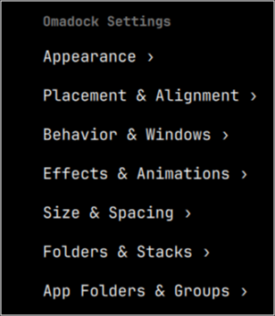
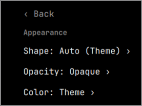
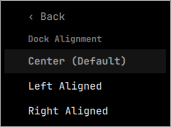
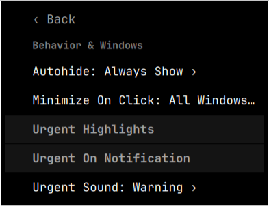
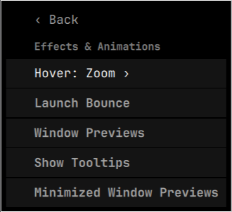

# Omadock (`omadock`)

<p align="center">
  
</p>

<p align="center">
  <b>A modern, high-performance application dock for <a href="https://omarchy.org">Omarchy</a> (Quickshell + Hyprland).</b>
</p>

<p align="center">
  <a href="https://github.com/thepathless/omadock/releases"></a>
  <a href="https://omarchy.org"></a>
  <a href="https://hyprland.org"></a>
  <a href="https://quickshell.org"></a>
  <a href="LICENSE"></a>
</p>

---

## 📖 Overview

**Omadock** is a lightweight, zero-CPU application dock built natively for **Omarchy Linux**. It pairs a clean, modern aesthetic with the power of the **Hyprland** tiling compositor.

Whether you run a single browser window or tile dozens of terminals across multiple workspaces, Omadock gives you:

- Instant visual window-state feedback via a 3-state indicator system
- Mouse-wheel window cycling with rich multi-window tooltips
- Sequential or batch minimization with live preview tiles on the dock
- Real-time attention alerts with optional audio chimes
- Live drag-and-drop pin reordering
- Pinned folder stacks with recent-file popovers
- Native FreeDesktop Desktop Actions (jump lists)
- Deep right-click customization — all without leaving the dock

---

## ⚡ Quick Start

### Install

```bash
omarchy plugin add https://github.com/thepathless/omadock.git --enable --yes
```

### Update

```bash
omarchy plugin update omadock --yes
```

### Removal / Uninstall

```bash
omarchy plugin remove omadock --yes
```

---

## 🌟 Feature Guide

### 🔘 1. The 3-State Window Indicator System

Underneath each running application icon, Omadock draws indicator dots that show the exact state of every window at a glance:

```
  ┌─────────────────────────────────────────────────────────────┐
  │  INDICATOR LEGEND:                                          │
  │   [ ▬ ] Active / Focused Window   (Illuminated Theme Bar)   │
  │   [ ● ] Open / Visible Window     (Solid High-Contrast Dot) │
  │   [ ○ ] Minimized / Parked Window (Hollow Circle Ring)      │
  └─────────────────────────────────────────────────────────────┘
```

- **Active Focused `[ ▬ ]`**: Expands into an illuminated pill bar in your active theme's accent color.
- **Open Visible `[ ● ]`**: Solid circle for every window sitting on your desktop.
- **Minimized `[ ○ ]`**: Hollow ring the moment a window is parked on `special:minimized`.

---

### 🔢 2. Adaptive Multi-Window Scaling

| Window Count | Indicator Display | Description |
| :--- | :--- | :--- |
| **1–4 windows** | `[ ▬ ] [ ● ] [ ○ ] [ ● ]` | Every window gets its own full-size dot or active bar. |
| **5 windows** | `[ ▬ ] [ ● ] [ ● ] [ ● ] [ ● ]` | Micro-dot compression (`4px`) fits 5 instances cleanly. |
| **6+ windows** | `[ ▬ ] [ ● ] [ ● ] [ ● ] [ +N ]` | First 4 states + a compact `+N` overflow badge. |

---

### 🔄 3. Minimize on Click (3 Modes)

```
                         ┌─────────────────────────────────┐
                         │   Click On Focused Dock Icon    │
                         └──────────────┬──────────────────┘
                                        │
             ┌──────────────────────────┼──────────────────────────┐
             ▼                          ▼                          ▼
     [ Active Window ]           [ All Windows ]             [ Disabled ]
  (Sequential FIFO — default)  (Group Batch / Hide)        (Standard / Classic)
```

1. **Active Window (`"active"` — default)**: Minimizes only the single focused window; focus passes to the next window. Each parked window appears as its own live preview tile.
2. **All Windows (`"all"`)**: One click parks every window of the app simultaneously. Each becomes its own preview tile.
3. **Disabled (`"off"`)**: Clicking an active app never minimizes — it cycles focus to the next window.

> **Intelligent focus & workspace navigation**: Left-clicking any running app brings its window forward. If the window is minimized, Omadock unminimizes and restores it; if it is on another workspace, Omadock navigates there and focuses it.

---

### 📜 4. Interactive Tooltips & Mouse-Wheel Selection

When an app has multiple windows open:

1. **Hover** the dock icon → a rich tooltip lists all visible windows (minimized ones appear as tiles instead).
2. **Scroll** the mouse wheel → a `›` cursor cycles through the window list live.
3. **Left-click** → directly focuses the selected window.

---

### 🪟 4b. Live Minimized-Window Preview Tiles

Minimized windows appear as **live preview tiles** between the pinned and running sections — oldest parked window on the left, newest on the right:

- Each tile shows a **real screenshot** of the window, an app badge, and a title tooltip.
- **Click a tile** → restores that exact window to its original workspace.
- **Right-click a tile** → Restore / Close actions.
- In **All Windows** mode, each app's windows compress into a single stacked group tile (badge shows the count; click restores all).
- Toggle via Settings → **Minimized Window Previews** or the `showMinimizedTiles` config key.

---

### ⚡ 5. FreeDesktop Desktop Actions (Jump Lists)

Right-click application icons to access native XDG desktop actions:

- **Browsers**: Open New Incognito / Private Window.
- **Editors & Terminals**: New Empty Window or recent workspaces.
- **Communication**: New Chat, Compose, or status change.
- **Web Apps / PWAs**: Open in browser or native window.

---

### 🗂️ 6. Pinned Folder Stacks & Recent Files

- **1-click popover**: Click any pinned folder (`~/Downloads`, custom directories) to reveal a sorted list of recent files (up to 16, newest first).
- **File metadata**: Mimetype icons, sizes, and relative times (`Just now`, `5m ago`, `2h ago`).
- **Direct launch**: Click any file to open it with `xdg-open`; click **Open in File Manager** at the bottom.
- **Folder picker**: Add any folder from Settings → **Folders & Stacks ›** via a native GTK folder dialog.

---

### 🎨 7. Themed Folder Colors & Symbolic Outlines

- **Auto Theme Sync**: Folder icon colors automatically track the active Omarchy theme.
- **Yaru Color Swatches**: Sage, Olive, Magenta, Purple, Blue, Red, Yellow, Brown, Teal, Charcoal.
- **Monochrome Symbolic Outlines**: Crisp outline glyphs for dark, vantablack, or minimal setups. Also available as explicit White / Black presets.

---

### 🔔 8. Notification Urgency & Audio Chimes

- When a background app receives a notification (Slack, Discord, Matrix, WhatsApp…), its dock icon **bounces and pulses** with an urgency glow.
- **Audio feedback**: Selectable chime (`Bell`, `Message`, `Complete`, `Info`, `Warning`, or `None`).
- **Foreground Suppression**: Urgency is automatically suppressed when you are already inside that window.
- **Startup Suppression**: Initial window-open urgency is ignored for 3 seconds to prevent false triggers on launch.
- **Omarchy DND Integration**: Sound alerts are automatically muted when system-wide Do Not Disturb is active.

---

### 🎨 9. Appearance & Deep Customization

Right-click the Omarchy logo → **Dock Settings** to access the full settings menu:

- **Corner Shapes**: `Auto (Theme)`, `Rounded`, `Round` (full pill), `Square`.
- **Background Opacity**: `Auto (Theme)`, `100%`, `80%`, `65%`, `35%`, `0% (Transparent)`.
- **Custom Color Swatches**: 10 curated presets (Pure Black, Mocha, Deep Slate, Midnight Blue, Dark Navy, Emerald Forest, Velvet Ruby…) plus automatic luminance contrast for foreground text.
- **Icon Size**: `Small (28px)`, `Medium (36px)`, `Large (44px)`, `Extra Large (52px)`.
- **Icon Spacing**: `Compact`, `Normal`, `Relaxed`.
- **Magnification**: `Wave` (raised-cosine falloff, grows layout), `Zoom` (single-icon peak), or `Off`.

<p align="center">
  
  &nbsp;
  
  &nbsp;
  
  &nbsp;
  
  &nbsp;
  
</p>

---

### 🎯 10. Zero-CPU Autohide & Tiling Adaptation

- **0.00% Idle CPU**: All state is driven by Hyprland's native IPC event bus — no polling loops.
- **Tiling Window Reservation**: In **Always Show** mode, Omadock sets a Wayland `exclusiveZone` so tiled windows never overlap the dock.
- **Intelligent Autohide**: Stays visible on empty workspaces; hides only when open windows overlap the dock area (AABB intersection check, triggered on window moves — not on a timer).

---

### 🔄 11. Live Drag-and-Drop Pin Reordering

- Click and drag any pinned icon horizontally to reorder it.
- A real-time insertion indicator shows the exact drop position.
- Pin order is persisted across reboots in `~/.config/omarchy/dock.json`.

---

## 🖱️ Controls Cheat Sheet

| Action | Target | Result |
| :--- | :--- | :--- |
| **Left Click** | Omarchy Logo | Opens the Omarchy Application Menu |
| **Right Click** | Omarchy Logo / Empty Dock Space | Opens Dock Settings |
| **Scroll** | Omarchy Logo | Cycles workspaces |
| **Middle Click** | Omarchy Logo | Opens a terminal |
| **Left Click** | App Icon | Launches, focuses, switches workspace, or minimizes/restores |
| **Middle Click** | App Icon | Opens a **new instance** of the application |
| **Scroll** | App Icon | Cycles focus between open windows |
| **Right Click** | App Icon | App menu (window list, Desktop Actions, Pin/Unpin, Quit) |
| **Left Click** | Folder Icon | Toggles the recent-files stack popover |
| **Right Click** | Folder Icon | Folder options (Open in File Manager, Unpin) |
| **Left Click** | Preview Tile | Restores that minimized window |
| **Right Click** | Preview Tile | Restore / Close |
| **Click & Drag** | Pinned Icon | Reorders position live |
| **Bottom Edge Hover** | Screen Bottom | Reveals the autohidden dock |

---

## ⚙️ Configuration Reference

All settings can be changed via the right-click menu or edited directly in `~/.config/omarchy/omadock.json`:

```json
{
  "autohide": true,
  "intelligentAutohide": true,
  "minimizeMode": "active",
  "showMinimizedTiles": true,
  "opacity": 1.0,
  "shape": "rounded",
  "bgColor": "theme",
  "itemSpacing": 4,
  "iconSize": 0,
  "hoverEffect": "zoom",
  "showAppsButton": true,
  "showTooltips": true,
  "advancedTooltips": true,
  "launchBounce": true,
  "showUrgentHint": true,
  "urgentOnNotification": true,
  "urgentSound": true,
  "urgentSoundName": "bell",
  "folderColor": "theme",
  "revealDelay": 160,
  "tooltipDelay": 450,
  "pinnedFolders": [
    { "path": "~/Downloads", "name": "Downloads", "icon": "folder-download" }
  ]
}
```

| Property | Type | Default | Description |
| :--- | :--- | :--- | :--- |
| `autohide` | `boolean` | `true` | Autohide on reveal. `false` = always visible. |
| `intelligentAutohide` | `boolean` | `true` | Hide only when a window overlaps the dock area. |
| `minimizeMode` | `string` | `"active"` | `"active"` (sequential FIFO), `"all"` (group batch), `"off"` (disabled). |
| `showMinimizedTiles` | `boolean` | `true` | Show minimized windows as live preview tiles on the dock. |
| `opacity` | `number \| string` | `1.0` | Background transparency: `"theme"` (auto), `1.0`, `0.80`, `0.65`, `0.35`, `0.0`. |
| `shape` | `string` | `"rounded"` | Corner style: `"rounded"`, `"round"` (full pill), `"square"`, `"theme"` (auto from Omarchy theme). |
| `bgColor` | `string` | `"theme"` | Background color: `"theme"` (auto), `"none"`, or a hex string e.g. `"#1e1e2e"`. |
| `folderColor` | `string` | `"theme"` | Folder icon color: `"theme"`, `"symbolic"`, `"white"`, `"black"`, `"Yaru-sage"`, `"Yaru-blue"`, etc. |
| `itemSpacing` | `number` | `4` | Gap between icons in pixels (`2`, `4`, `8`). |
| `iconSize` | `number` | `0` | Icon size in pixels (`28`, `36`, `44`, `52`; `0` = auto from bar height). |
| `hoverEffect` | `string` | `"zoom"` | `"zoom"` (single-icon peak), `"wave"` (raised-cosine falloff), `"off"`. |
| `showAppsButton` | `boolean` | `true` | Show/hide the Omarchy logo button. |
| `showTooltips` | `boolean` | `true` | Show app-name tooltips on hover. |
| `advancedTooltips` | `boolean` | `true` | Rich tooltips listing up to 8 windows; scroll to cycle, click to focus. |
| `launchBounce` | `boolean` | `true` | Bounce icon while an app is starting. |
| `showUrgentHint` | `boolean` | `true` | Pulse and bounce on urgency / attention demand. |
| `urgentOnNotification` | `boolean` | `true` | Trigger urgency when a desktop notification arrives. |
| `urgentSound` | `boolean` | `true` | Play a chime on urgency (auto-silenced in DND mode). |
| `urgentSoundName` | `string` | `"bell"` | Sound name: `"bell"`, `"message-new-instant"`, `"complete"`, `"dialog-information"`, `"none"`. |
| `screen` | `string` | `""` | Monitor name to pin the dock to (default: primary monitor). |
| `revealDelay` | `number` | `160` | Edge dwell time in ms before the hidden dock reveals (0–2000). |
| `tooltipDelay` | `number` | `450` | Hover dwell time in ms before tooltips appear (0–5000). |
| `pinnedFolders` | `array` | `[…]` | Pinned folder objects: `{ "path": "…", "name": "…", "icon": "…" }`. |

> **Legacy key**: `clickToMinimize` (boolean) is still read for backwards compatibility but is derived from `minimizeMode`. Prefer `minimizeMode`.

---

### Keyboard Bindings via IPC

Omadock exposes dock actions to Quickshell's IPC bus, bindable in `~/.config/hypr/bindings.lua`:

```lua
o.bind("SUPER + M",       "Minimize focused window",   "exec qs ipc call omadock minimizeActive")
o.bind("SUPER + SHIFT + M", "Restore oldest minimized", "exec qs ipc call omadock restoreLast")
```

| IPC Target | Action |
| :--- | :--- |
| `minimizeActive` | Park the currently focused window to `special:minimized` |
| `restoreLast` | Restore the longest-parked window across all apps (FIFO) |

---

### Pinned Applications (`~/.config/omarchy/dock.json`)

```json
{
  "pinned": [
    "foot",
    "org.gnome.Nautilus",
    "google-chrome",
    "code"
  ]
}
```

---

## ❓ FAQ

### How do I pin or unpin an application?
Right-click the app icon → **Pin to Dock** / **Unpin from Dock**. Drag pinned icons to reorder.

### Where do minimized windows go?
Omadock parks them on a hidden Hyprland workspace (`special:minimized`). Each appears as a **live preview tile** on the dock. Click a tile to restore the window to its original workspace.

### How do I make the dock fully transparent?
Right-click the Omarchy logo → **Appearance** → **Background Opacity** → **Transparent (0%)**. The dock renders a specular border around the icons.

### How do I reload the dock after editing config?
```bash
omarchy restart shell
```

---

## 🛠️ Diagnostics

```bash
# Validate plugin against Omarchy marketplace standards
omarchy plugin validate ~/Projects/omadock

# Live compositor logs
journalctl --user -xeu omarchy-shell -n 50 --no-pager

# Smoke-test IPC keybinds
qs ipc call omadock minimizeActive
qs ipc call omadock restoreLast
```

---

## 📄 License

Distributed under the [MIT License](LICENSE). Copyright © 2026 Suvadeep Mondal.
